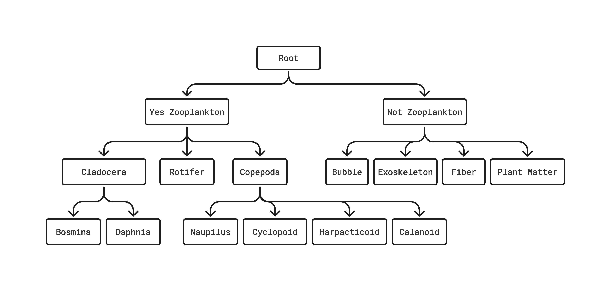
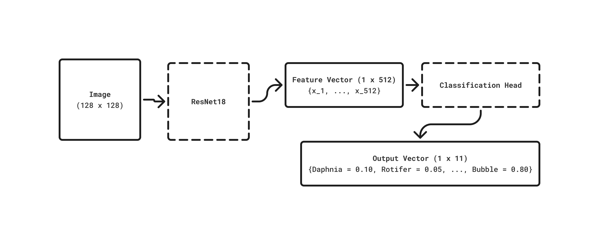
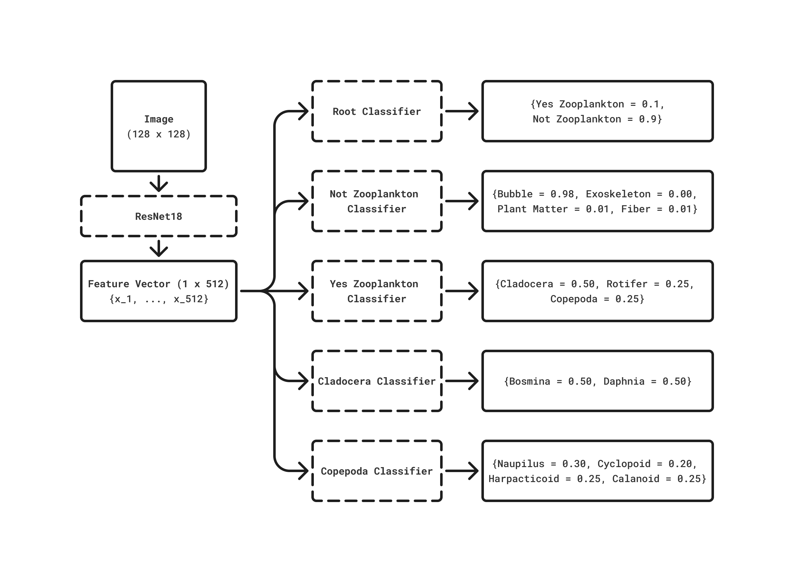

# Hierarchical CNNs for Zooplankton Image Classification

This repository provides a Python library for training and evaluating hierarchical 
CNNs for image classification, applied to a non-publicly-available dataset of
freshwater Zooplankton images and to the EMNIST[^1] (Extended-MNIST) character 
dataset (62 classes A-Z, a-z, 0-9).

The EMNIST dataset is available for download via the `torchvision.datasets` module. 
The Zooplankton images were provided by the Ontario Ministry of Natural Resources 
(OMNR).

The repository includes implementations of flat CNN baselines and a Local Classifier 
Per Parent Node[^2] (LCPN) architecture using a morphological hierarchy (for EMNIST)
and a taxonomic hierarchy (for Zooplankton).

## Directory Structure

This repository bundles a shared library for training and evaluating flat and
LCPN CNN classifiers under `python/cnn`, alongside experiments/training-demos on 
the EMNIST dataset (`python/emnist`) and Zooplankton dataset (`python/zooplankton`).

```
python/
├── cnn/src/cnn/       # Shared Library
│   ├── models/
│   │   ├── flat.py
│   │   └── hierarchical.py
│   ├── config.py
│   ├── data.py
│   ├── hierarchy.py
│   ├── metrics.py
│   └── utils.py
├── emnist/             # EMNIST demos
│   ├── 00_configs/
│   ├── 00_hierarchies/
│   ├── 00_raw_data/    # gitignored
│   ├── 01_results/     # gitignored
│   └── 99_demos/
└── zooplankton/        # Zooplankton demos and experiments
    ├── 00_configs/
    ├── 00_hierarchies/
    ├── 00_raw_data/    # gitignored
    ├── 01_results/     # gitignored
    ├── 97_experiments/
    ├── 98_eda/
    └── 99_demos/
```

## Architecture (Zooplankton)

### Hierarchy

Currently, Zooplankton are classified by the following taxonomic hierarchy.



### Flat Classifier

The flat classifier consists of a ResNet18 feature extractor and a single 
classification head, which produces a probability distribution over all 11 
leaf classes.



### LCPN Classifier

The LCPN classifier consists of a ResNet18 feature extractor and five classification 
heads, one per parent node in the hierarchy. Each head produces a probability 
distribution over its immediate children.



## Library: `cnn` package

The package is currently designed for internal use to support the experiments in 
this repository, but may be made more robust and well-documented in the future, 
for external use.

- `config.py`: `Config` class for loading and accessing TOML-based hyperparameter files.
- `data.py`: `ImageDataset` for flat models; `LCPNDataset` and `LCPNCollator` for hierarchical labelling and batching.
- `hierarchy.py`: `Hierarchy` class for loading, validating, and querying JSON hierarchy files.
- `metrics.py`: Miscellaneous flat and hierarchical classifier metrics functions.
- `utils.py`: `set_seed` and `split` for reproducible train/validation/test partitioning.
- `models/flat.py`: `FlatModel`, a flat CNN classifier built on a pretrained [timm](https://pypi.org/project/timm/) backbone (ResNet18 default). 
- `models/hierarchical.py`: `LCPNModel`, a LCPN architecture with one classification head per parent node. Supports greedy and globally optimal prediction and loading backbone weights from a trained `FlatModel`.

## Running Experiments

From the `python/` directory:
```bash
# Zooplankton (data unavailable)
uv run zooplankton/97_experiments/flat.py
uv run zooplankton/97_experiments/lcpn.py
uv run zooplankton/97_experiments/lcpn_flat_backbone.py

# EMNIST demos
uv run emnist/99_demos/01_flat_model.py
uv run emnist/99_demos/01_lcpn_model.py
uv run emnist/99_demos/03_flat_lcpn_comparison.py
```

Each script reads its configuration from the corresponding TOML file in 
`00_configs/` and writes model weights, configuration, and metrics to a directory 
in `01_results/`.

The `load()` method of the `FlatModel` and `LCPNModel` classes supports re-loading
a trained model from its save directory in `01_results/`.

## Project Setup

### Python

Dependencies are managed with `uv`. Run the following in the terminal at
the repo root:

``` bash
uv sync --project python
```

This creates `python/.venv` and installs the required python dependencies.

### Check Your Installation

To confirm everything is installed correctly you may run the following demo
script:

``` bash
uv run python/emnist/99_demos/01_flat_model.py
```

If the installation is in working order, this script will download the EMNIST
image dataset to the `python/emnist/00_raw_data` directory, train a flat multi-class
CNN classifier on the 62 EMNIST classes, and save the results to a directory:
`python/emnist/01_results/demo_flat`.

To train a demo LCPN classifier instead, run: 

``` bash
uv run python/emnist/99_demos/01_lcpn_model.py
```

### Code Formatting

Formatting is enforced on commit via
[pre-commit](https://pre-commit.com/). Python files are checked and re-formatted 
using [Ruff](https://docs.astral.sh/ruff/). Install `pre-commit` and set
up the hooks once:

``` bash
uv tool install pre-commit
pre-commit install
```

After that, formatting runs automatically on every commit. If files are
modified by the formatter, the commit will fail, after which you can
stage the modified files and commit again.

[^1]: Cohen, G., Afshar, S., Tapson, J., & van Schaik, A. (2017). EMNIST: Extending MNIST to handwritten letters. Proceedings of the International Joint Conference on Neural Networks (IJCNN). https://doi.org/10.1109/IJCNN.2017.7966217

[^2]: Silla, C.N., Freitas, A.A. A survey of hierarchical classification across different application domains. Data Min Knowl Disc 22, 31–72 (2011). https://doi.org/10.1007/s10618-010-0175-9
